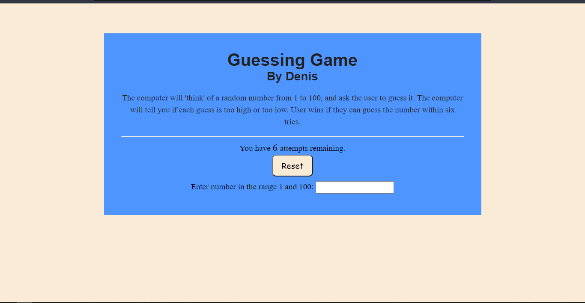

# GuessingGame Web

The computer picks a random number from 1 to 100, and ask the user to guess it. The computer will answer if each guess is too high or too low. User wins if they can guess the number within six tries.

## Technologies Used
- **HTML** & **CSS** for frontend.
- **Vanilla Javascript** for handling the game logic.

### Setup.
- Download the files *index.html*, *main.css* & *main.js*.
- Open *index.html* in your favourite browser and play to your heart's content.
